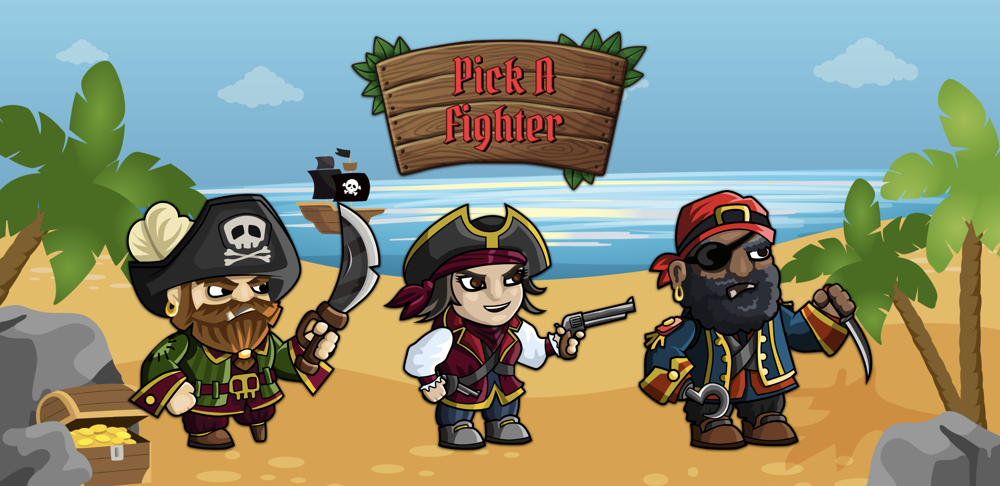
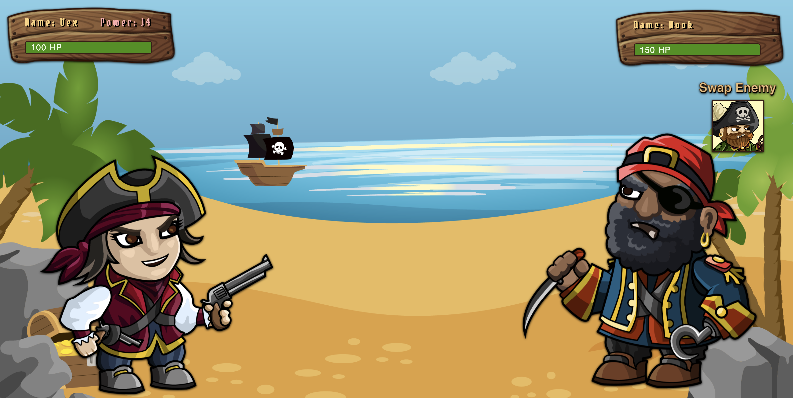

# Pirate RPG

## Preview

 

## About

<i><b>Pirate RPG</b></i> is a fighting/strategy game based on a war between the pirates. The goal is to conquer the other pirates by defeating their toughest fighters. If attacks aren't planned accordingly then your crew may wind up on the losing end.

## How To Play

* Choose a character and an opposing character
* Click anywhere on the screen to attack
* For every attack your attack power increases
* An enemy's attack power will remain the same throughout the match

## Technologies

&nbsp; &nbsp;
&nbsp; &nbsp; &nbsp; 
